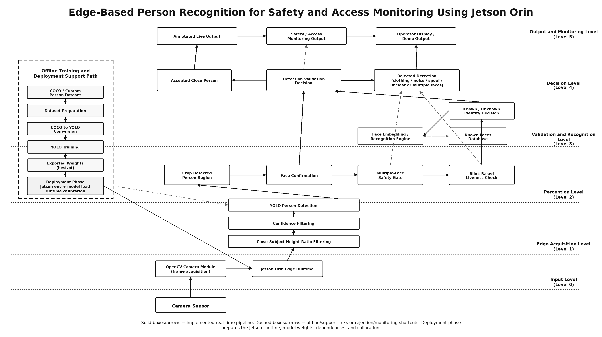

# Jetson Guard

## Edge-Based Person Verification and Monitoring System Using Jetson Orin

Jetson Guard is a deployable edge-AI vision system that acts as a local person-verification layer before another system trusts, monitors, or responds to a human subject. Running directly on NVIDIA Jetson Orin, it detects a nearby person from a live camera feed, validates that the detected region contains a real face, verifies liveness through blink detection, rejects spoof attempts, and classifies the verified subject as Known or Unknown without cloud inference.

The project is built as a practical guard point for real-world automation systems, not just a model demo. Once a live person is verified, the same pipeline can immediately branch into access control, restricted-area monitoring, operator verification, safety alerts, activity monitoring, or person-aware robotics workflows.

## Immediate Use Cases

The following are the immediate use cases of this product:

| Use Case | Immediate Value |
|---|---|
| Access control | Verifies a live Known/Unknown person before allowing entry |
| Restricted-area monitoring | Detects and verifies people in sensitive or controlled spaces |
| Operator verification | Confirms an authorized person before enabling a machine, robot, or workflow |
| Safety monitoring | Verifies people near labs, robots, equipment, or hazardous zones |
| Activity monitoring | Starts tracking activity only after confirming a real live person |
| Smart security camera | Performs local person verification without cloud inference |
| Attendance / presence verification | Confirms physical presence using live-person validation |
| Human-aware robotics | Lets robots respond only after verifying a real person nearby |
| Automation trigger system | Uses person verification before triggering doors, lights, alarms, logs, or robot behavior |
| Edge-AI security prototype | Provides a foundation for future access-control, monitoring, and person-aware automation systems |

```text
v1.0.0-jetson — Final NVIDIA Jetson Orin Edge Deployment Version

```


<p align="center">
  <a href="assets/">
    
  </a>
</p>

<p align="center">
  <sub><b>Click the architecture image to browse demos, bug-fix evidence, and project assets.</b></sub>
</p>


```text
v1.0.0-jetson — Final NVIDIA Jetson Orin Edge Deployment Version
```


---


## Demos / Bug Fixes

The project was validated through demos, bug-fix evidence, and Jetson deployment testing.

### Demo Cases

```text
Real face + blink            → recognition allowed
Real face without blink      → recognition blocked
Phone/computer face image    → spoof rejected
Multiple faces               → recognition paused
Clothing/person-like object  → rejected after face confirmation
Jetson deployment            → full pipeline validated on edge hardware
```

### Main Bug Fixes

- Fixed person-shaped false positives using face confirmation
- Added multiple-face safety gate
- Added blink-based liveness verification
- Added static phone/computer spoof rejection
- Fixed Jetson OpenCV Haar cascade loading issue
- Rebuilt face embeddings on Jetson for runtime compatibility
- Tuned liveness timing for Jetson hardware speed
- Solved Jetson PyTorch/CUDA/CUPTI setup issues

### Evidence Folders

```text
assets/demos/
assets/bug_evidence/
```

---
## Model Training

The YOLO person detector was trained using a COCO person subset.

```text
Model:             YOLO11m person detector
Training images:   10,000
Validation images: 2,000
Epochs:            50
```

Final evaluation metrics:

```text
Precision: 0.782
Recall:    0.611
mAP50:     0.709
mAP50-95:  0.458
```

Model output:

```text
models/person_detector/best.pt
```

## Other Implications / Uses

Jetson FaceGuard can be extended into several real-world edge-AI applications:

- Safety monitoring in labs, classrooms, or restricted spaces
- Local access-control systems
- Smart door/security camera prototypes
- Identity-aware edge monitoring without cloud inference
- Retail or workspace monitoring
- Human-aware robotics perception
- Multi-camera safety monitoring systems

The key lesson from this project is that real-world AI is more than training a model. A deployable system needs preprocessing, validation logic, safety gates, hardware calibration, debugging, and clear operator feedback.

---

## Final Releases

| Release | Purpose |
|---|---|
| `v1.0.0-pc` | Final PC development and testing version |
| `v1.0.0-jetson` | Final NVIDIA Jetson Orin edge deployment version |

---


```

---

## Jetson Orin Deployment

The final Jetson version was deployed and validated on NVIDIA Jetson Orin.

Jetson-specific deployment work included:

- Jetson-compatible PyTorch installation
- CUDA/CUPTI runtime setup
- OpenCV system package usage
- Haar cascade path fallback for Jetson OpenCV
- Known-face embeddings rebuilt on Jetson
- Jetson-specific blink/liveness timing calibration
- Final deployment testing on edge hardware

Final Jetson release:

```text
v1.0.0-jetson
```

---

## Private Data

The following data is intentionally ignored by Git:

```text
data/known_faces/*
data/face_embeddings/*
```

Only placeholder `.gitkeep` files are tracked.

Do not commit:

```text
data/known_faces/<person_name>/
data/face_embeddings/known_faces.pkl
```

---

## Version History

| Version | Milestone |
|---|---|
| `v0.1.0` | Camera pipeline |
| `v0.2.0` | Face detection baseline |
| `v0.3.0` | YOLO close-person detection |
| `v0.3.1` | Clothing false-positive fix |
| `v0.4.0` | Face enrollment |
| `v0.5.0` | Live known/unknown recognition |
| `v1.0.0-pc` | Final PC development/testing version |
| `v1.0.0-jetson` | Final NVIDIA Jetson Orin deployment version |

---

## Technologies Used

- Python
- OpenCV
- YOLO / Ultralytics
- face_recognition
- dlib
- NumPy
- PyTorch / CUDA
- NVIDIA Jetson Orin
- Git and GitHub Releases

---

## Known Limitations

- Blink-based liveness improves spoof rejection but is not a full production-grade anti-spoofing system.
- Recognition accuracy can vary under poor lighting, occlusion, or extreme face angles.
- Multi-person scenes are intentionally paused instead of resolved through tracking.
- The current system is designed for a single-camera setup.

---

## Future Improvements

- Stronger anti-spoofing model
- Face tracking across frames
- Event logging dashboard
- Multi-camera support
- Better low-light recognition
- Access-control hardware integration
- Jetson performance optimization
