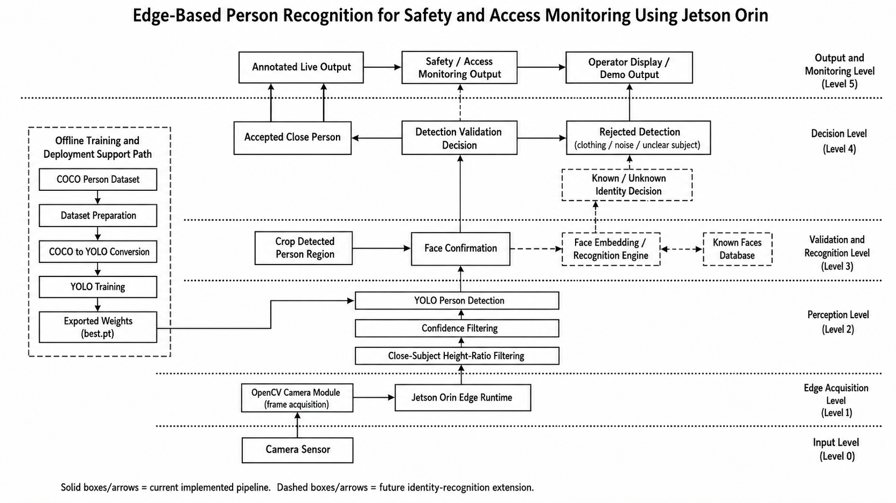

# Edge-Based Person Recognition for Safety and Access Monitoring Using Jetson Orin

An edge-AI safety and access monitoring system designed to detect close human subjects, validate detections, reject person-shaped false positives, enroll known faces locally, and recognize known vs unknown people on NVIDIA Jetson Orin.

<p align="center">
  <a href="assets/">
    
  </a>
</p>

<p align="center">
  <sub><b>Click the architecture image to browse demos, bug-fix evidence, and project assets.</b></sub>
</p>

---

## Project Overview

This project builds a local computer vision pipeline for safety and access monitoring using a camera and edge inference. The system detects a close human subject, validates that the detected region contains a visible face, rejects false positives such as hanging clothing or person-shaped background objects, enrolls known faces locally, and recognizes whether a live detected subject is known or unknown.

The system is not designed as a general surveillance detector. It is designed as a close-range safety-scanning and access-monitoring pipeline where a valid detection requires both:

1. A close person-like region detected by YOLO.
2. A visible face confirmed inside that same detected region.

The recognition stage adds another layer:

3. A face embedding generated from the confirmed face crop.
4. A comparison against a private local known-face database.

This creates a multi-stage validation and recognition system:

```text
YOLO person detection
+
Face confirmation inside YOLO box
+
Face embedding comparison
=
Known / Unknown close-person recognition
```

The long-term goal is to build a complete local identity-aware safety scanner that can classify a detected subject as known or unknown without relying on cloud inference.

---

## Current Version

```text
v0.5.0
```

Current functionality:

- Live camera input using OpenCV.
- YOLO-based person detection.
- Close-subject filtering using bounding-box height ratio.
- Face confirmation inside each YOLO-detected person box.
- Rejection of hanging clothing and person-shaped false positives.
- Local face enrollment workflow.
- Automatic face embedding database update after enrollment.
- Private known-face database using `known_faces.pkl`.
- Live known/unknown face recognition.
- Integrated recognition pipeline through `src/main.py`.
- Demo and bug-fix evidence videos.
- Local edge-oriented architecture prepared for Jetson Orin deployment.

---

## Current Runtime Flow

```text
Camera Sensor
↓
OpenCV Camera Module
↓
Jetson Orin Edge Runtime
↓
YOLO Person Detection
↓
Confidence Filtering
↓
Close-Subject Height-Ratio Filtering
↓
Crop Detected Person Region
↓
Face Confirmation
↓
Face Crop
↓
Face Embedding Generation
↓
Compare Against Known Face Database
↓
Known / Unknown Decision
↓
Annotated Live Output
↓
Safety / Access Monitoring Output
```

---

## Why YOLO + Face Confirmation + Face Recognition?

A face detector alone can only answer:

```text
Is there a frontal face somewhere in the frame?
```

That is not enough for a safety scanner because a random face in the background or a face-like image may create incorrect behavior.

A YOLO person detector alone can answer:

```text
Is there a person-shaped object in the frame?
```

But YOLO can still falsely detect hanging clothing, jackets, mannequins, or other person-shaped objects as a person.

The combined system is stronger because it asks:

```text
Is there a close person-shaped region?
Does that same detected region contain a visible face?
Does that face match a locally enrolled known person?
```

This makes the pipeline stricter and more useful for safety and access monitoring.

---

## Current Recognition Rule

A recognition result is accepted only when all conditions are satisfied:

```text
YOLO detects a person-shaped object
AND detection confidence passes threshold
AND detected box is large enough to be close
AND a visible face is found inside that same YOLO box
AND a valid face embedding is generated
AND the embedding is compared against the known-face database
```

A detection is rejected or ignored when:

```text
No face is found inside the YOLO box
OR the object is too small/far away
OR the object is clothing/noise/unclear subject
OR the face crop cannot produce a valid embedding
```

This means the system intentionally rejects unclear body-only detections or side/profile cases where a visible face is not confirmed. This is acceptable for the current safety-scanning workflow because the subject is expected to face the scanner.

---

## Version History

### v0.1.0 — Camera Module

Implemented the base camera pipeline.

Features:

- Open camera feed using OpenCV.
- Read live frames.
- Display camera window.
- Quit safely using `q`.
- Release camera resources properly.

Main files:

```text
src/camera.py
src/main.py
src/config.py
```

---

### v0.2.0 — Face Detection Baseline

Added a simple face detection baseline using OpenCV Haar Cascade.

Purpose:

- Validate live frame processing.
- Test face detection on real camera input.
- Build a reusable `process_frame()` structure.

Main file:

```text
src/face_detector.py
```

This module later became useful as the face-confirmation stage inside the YOLO detection pipeline.

---

### v0.3.0 — YOLO Live Close-Person Detection

Integrated a trained YOLO person detector into the live camera pipeline.

Major work completed:

- Prepared a COCO person subset.
- Converted COCO annotations into YOLO format.
- Trained a YOLO11s person detector.
- Evaluated the training run.
- Integrated the trained `best.pt` model into the live camera pipeline.
- Added close-subject height-ratio filtering.
- Added demo video proof.

Training dataset used:

```text
Training images:   10,000
Validation images: 2,000
```

Final evaluation metrics from the training run:

```text
Precision: 0.782
Recall:    0.611
mAP50:     0.709
mAP50-95:  0.458
```

Known issue discovered:

```text
Hanging clothing or person-shaped objects could be falsely detected as a close person.
```

This issue was moved into the patch version `v0.3.1`.

---

### v0.3.1 — Face Confirmation False-Positive Fix

Added a second-stage validation step to reduce false-positive detections.

Problem fixed:

```text
Hanging clothing was detected as a close person.
```

Fix implemented:

```text
Each YOLO-detected person box must contain a visible face before being accepted.
```

Updated validation logic:

```text
YOLO detects person-like object
↓
Height ratio confirms object is close enough
↓
System crops the YOLO person box
↓
Face detector checks inside that crop
↓
If face is found: accept as close person
↓
If face is not found: reject detection
```

Validated behavior:

- Detects a person only when a visible face is present.
- Rejects hanging clothing and person-shaped objects.
- Rejects non-human visual noise.
- Rejects unclear body-only or partial scan subjects when no face is visible.

Known limitation:

```text
The current face confirmation step is intentionally strict.
It works best when the subject presents a visible frontal face to the scanner.
Side/profile faces or poorly visible faces may be rejected.
```

This behavior is acceptable for the current safety-scanning workflow.

---

### v0.4.0 — Face Enrollment Module

Added a local face enrollment workflow for creating a known-person dataset.

Major work completed:

- Added an independent face enrollment script.
- Used YOLO person detection before enrollment.
- Required face confirmation inside the YOLO person crop.
- Added manual enrollment start behavior.
- Saved verified face crops locally under each person’s folder.
- Kept enrolled face images private and ignored by Git.

Enrollment output structure:

```text
data/known_faces/
└── phoenix/
    ├── phoenix_001.jpg
    ├── phoenix_002.jpg
    └── phoenix_003.jpg
```

Main file:

```text
scripts/enroll_face.py
```

Purpose:

```text
Create a clean local dataset of known people for future recognition.
```

---

### v0.5.0 — Known/Unknown Face Recognition

Added the live known/unknown recognition pipeline.

Major work completed:

- Added face embedding builder.
- Added private known-face embedding database workflow.
- Added `FaceRecognizer` module.
- Added `RecognitionProcessor` integration layer.
- Updated `YOLODetector` to expose reusable person detection data.
- Integrated live known/unknown recognition into `src/main.py`.
- Added automatic embedding update after enrollment.
- Added recognizer test script.
- Added live recognition test script.
- Added demo video evidence.

Recognition flow:

```text
Close person detected
↓
Face confirmed
↓
Face crop extracted
↓
Face embedding generated
↓
Compared with known face database
↓
Known / Unknown result
```

Known limitations:

```text
Phone-screen face images can still be recognized.
Multiple-face handling needs a stronger single-subject safety gate.
Liveness / anti-spoof detection is not implemented yet.
Further robustness testing is needed under lighting, angle, and occlusion changes.
```

---

## Project Structure

```text
.
├── assets/
│   ├── architecture/
│   │   └── architecture.png
│   │
│   ├── demos/
│   │   ├── v0.3.0/
│   │   │   └── v0.3.0_yolo_live_close_person_detection_demo.mp4
│   │   │
│   │   └── v0.5.0/
│   │       └── live_known_unknown_face_recognition_demo.mp4
│   │
│   └── bug_evidence/
│       └── v0.3.1/
│           ├── v0.3.1_before_clothing_false_positive_bug.mp4
│           └── v0.3.1_after_face_confirmation_false_positive_fix.mp4
│
├── data/
│   ├── known_faces/
│   │   └── .gitkeep
│   │
│   └── face_embeddings/
│       └── .gitkeep
│
├── datasets/
│   └── detection/
│       ├── raw/
│       ├── processed/
│       └── data.yaml
│
├── models/
│   └── person_detector/
│       └── best.pt
│
├── scripts/
│   ├── prepare_coco_person_subset.py
│   ├── train_yolo_person_detector.py
│   ├── enroll_face.py
│   ├── build_face_embeddings.py
│   ├── test_face_recognizer.py
│   └── test_live_recognition.py
│
├── src/
│   ├── camera.py
│   ├── config.py
│   ├── face_detector.py
│   ├── face_recognizer.py
│   ├── recognition_processor.py
│   ├── main.py
│   └── yolo_detector.py
│
├── .gitignore
├── requirements.txt
└── README.md
```

---

## Main Software Components

### `src/main.py`

Application entry point.

Responsibilities:

- Loads camera configuration.
- Creates the camera object.
- Creates the YOLO detector object.
- Creates the face detector object.
- Creates the face recognizer object.
- Creates the recognition processor.
- Starts the live camera loop.
- Sends each frame into the integrated recognition pipeline.

---

### `src/camera.py`

Camera acquisition module.

Responsibilities:

- Open the camera.
- Read frames.
- Send frames to a frame processor.
- Display processed frames.
- Release the camera safely.

The key design is that the camera module can accept any object with:

```python
process_frame(frame)
```

or any callable frame processor object.

This allows the system to switch between face detection, YOLO detection, and recognition modules cleanly.

---

### `src/yolo_detector.py`

YOLO-based person detection module.

Responsibilities:

- Load the trained YOLO model.
- Run person detection on every frame.
- Apply confidence filtering.
- Apply close-subject height-ratio filtering.
- Return reusable person bounding box data.
- Support YOLO-only frame processing for testing.

The detector exposes reusable person detections through:

```python
detect_persons(frame)
```

Example output:

```python
[
    {
        "x1": 120,
        "y1": 80,
        "x2": 500,
        "y2": 700,
        "confidence": 0.91
    }
]
```

---

### `src/face_detector.py`

Face confirmation module.

Responsibilities:

- Load OpenCV Haar Cascade face detector.
- Convert frames or crops into grayscale.
- Detect frontal faces.
- Return face bounding boxes.

In the current pipeline, this module confirms whether the YOLO-detected person region contains a visible face.

---

### `src/face_recognizer.py`

Known/unknown face recognition module.

Responsibilities:

- Load the private known-face embedding database.
- Convert a live cropped face image into an embedding.
- Compare the live embedding against known stored embeddings.
- Return a recognized name or `Unknown`.

Output examples:

```text
Known: phoenix
```

or:

```text
Unknown
```

The recognizer uses:

```text
data/face_embeddings/known_faces.pkl
```

---

### `src/recognition_processor.py`

Main integration module for live recognition.

Responsibilities:

- Receive each camera frame.
- Run YOLO person detection.
- Crop detected person regions.
- Run face detection inside each person region.
- Crop the detected face.
- Send the face crop to `FaceRecognizer`.
- Draw known/unknown labels on the live frame.
- Ignore YOLO false positives when no face is found.

This module keeps `src/main.py` clean while handling the full frame-processing workflow.

---

### `src/config.py`

Central configuration file.

Example values:

```python
CAMERA_INDEX = 0

YOLO_MODEL_DIR = "models/person_detector/best.pt"
YOLO_CONFIDENCE_THRESHOLD = 0.50
MIN_PERSON_HEIGHT_RATIO = 0.35

KNOW_FACES_DIR = "data/known_faces"
FACE_EMBEDDINGS_FILE = "data/face_embeddings/known_faces.pkl"
FACE_RECOGNITION_THRESHOLD = 0.55
```

Meaning:

```text
YOLO_CONFIDENCE_THRESHOLD = minimum confidence needed to keep a detection
MIN_PERSON_HEIGHT_RATIO = minimum box height ratio needed to count as close
FACE_RECOGNITION_THRESHOLD = maximum distance allowed for known-face match
```

For a 1080p camera frame:

```text
0.35 × 1080 = 378 pixels
```

So the detected person box must be at least 378 pixels tall to pass the close-subject filter.

---

## Face Enrollment and Recognition Workflow

### 1. Enroll a Person

Run:

```bash
python scripts/enroll_face.py
```

The script:

```text
asks for a person name
detects the person using YOLO
confirms a face inside the person box
saves verified face crops
automatically updates the face embedding database
```

Output structure:

```text
data/known_faces/<person_name>/
```

Example:

```text
data/known_faces/phoenix/
├── phoenix_001.jpg
├── phoenix_002.jpg
└── phoenix_003.jpg
```

---

### 2. Automatic Face Embedding Update

After enrollment completes, the system automatically rebuilds:

```text
data/face_embeddings/known_faces.pkl
```

This file stores:

```text
known person names
+
matching face embeddings
```

This means live recognition can immediately use the newly enrolled person.

---

### 3. Manual Embedding Rebuild

This is optional because enrollment updates the database automatically.

Run:

```bash
python scripts/build_face_embeddings.py
```

Use this when:

```text
face images were manually added
face images were deleted
known-face folders were modified outside the enrollment script
```

---

### 4. Test Face Recognition

Run:

```bash
python scripts/test_face_recognizer.py
```

Expected output:

```text
Expected name: <person_name>
Recognized name: <person_name>
Distance: <score>
```

---

### 5. Run Live Recognition

Run:

```bash
python src/main.py
```

Expected live output:

```text
Known: <person_name> | <distance>
```

or:

```text
Unknown | <distance>
```

Quit the camera window:

```text
Press q
```

---

## Model Training Pipeline

The YOLO detector was trained using a COCO person subset.

Training preparation script:

```text
scripts/prepare_coco_person_subset.py
```

Training script:

```text
scripts/train_yolo_person_detector.py
```

Dataset configuration:

```text
datasets/detection/data.yaml
```

Training output:

```text
models/person_detector/best.pt
```

Current model:

```text
YOLO11s person detector
```

Training summary:

```text
Training images:   10,000
Validation images: 2,000
Epochs:            50
Output:            best.pt
```

Final evaluation metrics:

```text
Precision: 0.782
Recall:    0.611
mAP50:     0.709
mAP50-95:  0.458
```

---

## Evidence and Validation

### Architecture

System architecture image:

```text
assets/architecture/architecture.png
```

The architecture image at the top of this README links to the `assets/` folder, where demo and validation evidence can be reviewed.

---

### Demo Videos

All demo videos are stored under:

```text
assets/demos/
```

v0.3.0 demo video:

```text
assets/demos/v0.3.0/v0.3.0_yolo_live_close_person_detection_demo.mp4
```

Purpose:

```text
Shows trained YOLO live close-person detection running in the camera pipeline.
```

v0.5.0 demo video:

```text
assets/demos/v0.5.0/live_known_unknown_face_recognition_demo.mp4
```

Purpose:

```text
Shows the integrated live recognition pipeline detecting a subject and displaying Known / Unknown identity output.
```

---

### Bug-Fix Evidence

All bug-fix evidence videos are stored under:

```text
assets/bug_evidence/
```

v0.3.1 bug-fix evidence videos:

```text
assets/bug_evidence/v0.3.1/v0.3.1_before_clothing_false_positive_bug.mp4
assets/bug_evidence/v0.3.1/v0.3.1_after_face_confirmation_false_positive_fix.mp4
```

Purpose:

```text
Shows the clothing false-positive problem before the fix and validates the face-confirmation fix after implementation.
```

---

## How to Run

Create and activate a virtual environment:

```bash
python -m venv .venv
source .venv/bin/activate
```

Install dependencies:

```bash
pip install -r requirements.txt
```

Run the live scanner:

```bash
python src/main.py
```

Quit the camera window:

```text
Press q
```

---

## Current Recognition Behavior

The current system accepts a close-person recognition attempt only when:

```text
YOLO detects a person-shaped object
AND confidence is high enough
AND detected box is large enough
AND a visible face is found inside the same detected box
AND a valid face embedding is produced
```

The system rejects or ignores:

- Hanging clothing.
- Person-shaped background objects.
- Non-human visual noise.
- Body-only detections without face confirmation.
- Partial or unclear scan poses where the face is not visible.
- Face crops that cannot produce a valid embedding.

This makes the system stricter and better aligned with safety/access scanning.

---

## Private Data Handling

This project intentionally keeps private face data out of Git.

Ignored private data includes:

```text
data/known_faces/*
data/face_embeddings/*
```

Only `.gitkeep` files are tracked so the folder structure remains visible.

Do not commit:

```text
data/known_faces/<person_name>/
data/face_embeddings/known_faces.pkl
```

These files contain private identity-related data.

---

## Known Limitations

This release is a pre-release milestone. The pipeline works, but additional safety and robustness work is planned.

Known limitations:

- Phone-screen face images can still be recognized.
- Multiple-face handling needs a stronger single-subject safety gate.
- Liveness / anti-spoof detection is not implemented yet.
- Recognition robustness still needs more testing under lighting, angle, and occlusion changes.
- Haar-based face detection works best with visible frontal faces.

---

## Design Principles

This project follows these design principles:

```text
Edge-only inference
Privacy-aware local processing
Two-stage validation: person detection + face confirmation
Local known/unknown recognition
Modular software design
Versioned development workflow
Evidence-based testing with demo and bug-fix videos
```

---

## GitHub Workflow

This project uses a branch-based workflow with issues, pull requests, milestone tags, and releases.

Completed release tags:

```text
v0.3.0
v0.3.1
v0.4.0
v0.5.0
```

Selected v0.3 milestone tags:

```text
v0.3.0-m1-yolo-data-preparation
v0.3.0-m2-yolo-training
v0.3.0-m3-yolo-training
```

Completed branches included:

```text
v0.3-yolo-face-detection-module
v0.3.1-fix-clothing-false-positive
v0.4-face-enrollment-module
v0.5-known-unknown-face-recognition
```

The project also uses pull requests for review before merging into `main`.

---

## Planned Next Stage

### v0.5.1 — Single-Subject Recognition Gate

Next goal:

```text
Improve safety when multiple faces or multiple people appear in the frame.
```

Planned behavior:

- Detect all valid recognition candidates in a frame.
- Recognize only when exactly one valid face is present.
- Pause recognition when multiple faces are visible.
- Display a clear warning such as:

```text
Multiple faces detected | Recognition paused
```

---

### v0.6.0 — Liveness / Anti-Spoof Detection

Next goal:

```text
Reduce phone-screen or image-based face spoofing.
```

Planned options:

- Blink detection.
- Face motion across frames.
- Texture or screen-pattern checks.
- Phone/screen object detection.
- Challenge-response behavior.
- Optional depth-based validation if supported by hardware.

---

## Long-Term Goal

The long-term goal is to build a complete edge-based safety and access monitoring prototype that can:

- Detect a close scan subject.
- Confirm that the subject is human.
- Reject false positives and unclear scan cases.
- Enroll known people locally.
- Recognize known vs unknown individuals.
- Run locally on Jetson Orin.
- Preserve privacy by avoiding cloud inference.
- Provide reliable real-time feedback for safety and access monitoring workflows.

---

## Current Status Summary

```text
Camera pipeline:              Complete
Face detection baseline:      Complete
YOLO person detector:         Complete
Live YOLO integration:        Complete
False-positive reduction:     Complete
Face enrollment:              Complete
Face embedding database:      Complete
Known/unknown recognition:    Complete
Main pipeline integration:    Complete
Single-subject safety gate:   Planned
Liveness / anti-spoof:        Planned
Jetson deployment hardening:  Planned
```